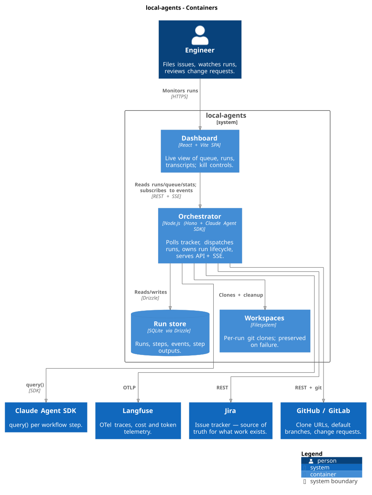
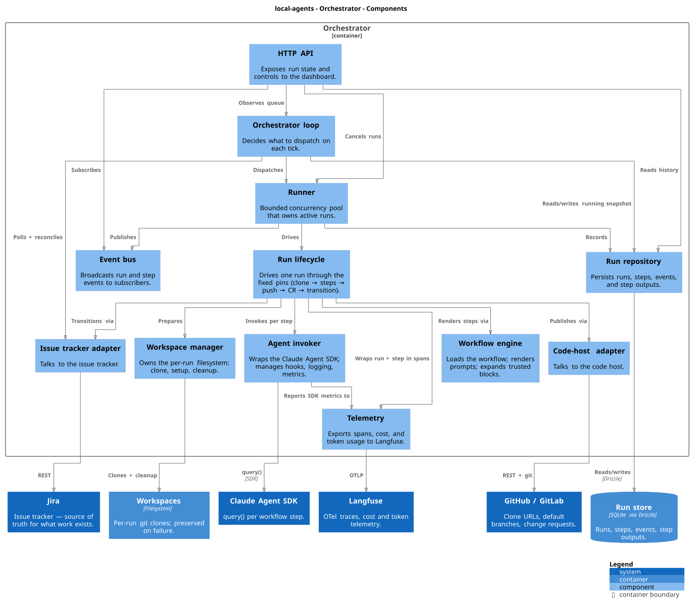

# Module Map

C4-style view of how the codebase is actually put together. For the runtime/behavioural view see [architecture.md](architecture.md).

The diagrams are generated from a single Structurizr workspace at [`diagrams/workspace.dsl`](diagrams/workspace.dsl). See [`diagrams/README.md`](diagrams/README.md) for regeneration.

## Glossary

Shared vocabulary used across the diagrams. Terminology matches [architecture.md](architecture.md); some labels are abbreviated in the diagrams for space (e.g. CR for change request).

| Term | Description |
|------|-------------|
| Adapter | Module talking to a specific external system behind a stable interface. Swapping providers means writing a new adapter. |
| Change request (CR) | Pull/merge request opened against the code host once a run's steps succeed. |
| Code host | GitHub or GitLab. Source of clone URLs, default branches, and CRs. |
| Issue tracker | Jira today. Source of truth for what work exists and its state. |
| Prompt | Rendered step template passed to the Claude Agent SDK for one step. |
| Ready issue | Issue the tracker has flagged as eligible for the orchestrator to pick up on its next tick. |
| Run | One end-to-end execution of the workflow against one issue. |
| Setup script | `.agent/setup.sh` in the target repo. Bootstraps the workspace toolchain (installs, codegen) so the workflow stays portable. |
| Span | OTel span exported to Langfuse. One per run, with child spans per step. |
| Step | A single unit in a workflow. Invokes the Claude Agent SDK once. |
| Workflow | `workflow.yaml`: the ordered set of steps the orchestrator runs per issue. |
| Workspace | Per-run git clone on the local filesystem. Disposed on success, preserved on failure. |

## Containers

## Orchestrator components

The orchestrator is a single Node.js process. The components below are logical modules inside `server/` — not separate services.

## Reading guide

- **One process, many modules.** Everything inside the orchestrator boundary runs in the same Node.js process. The boundaries are about responsibility, not deployment.
- **Adapters are the only platform coupling.** Swapping Jira, GitHub, or GitLab means writing a new adapter and wiring the factory; nothing else moves.
- **Lifecycle pins, not workflow choices.** Push, change-request creation, and tracker transition fire from the run lifecycle at fixed points — see [ADR 0001](adr/0001-phase-outputs-and-fixed-lifecycle.md).
- **Event bus is in-process.** SSE on `/events` is a thin fan-out over the same pub/sub the runner emits to; no external broker.
- **Workspaces are disposable on success, preserved on failure.** Treated as a container in the diagram because the filesystem state outlives any single tick.
